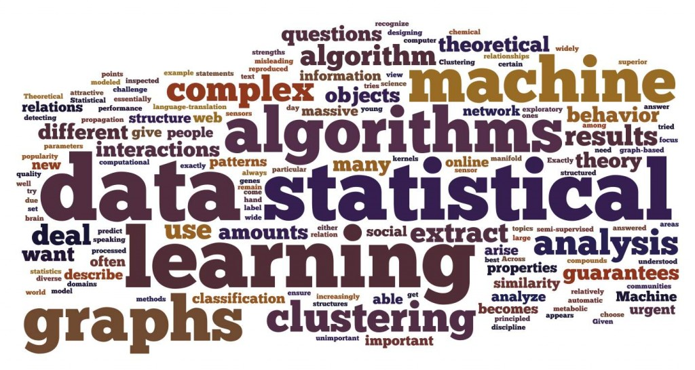
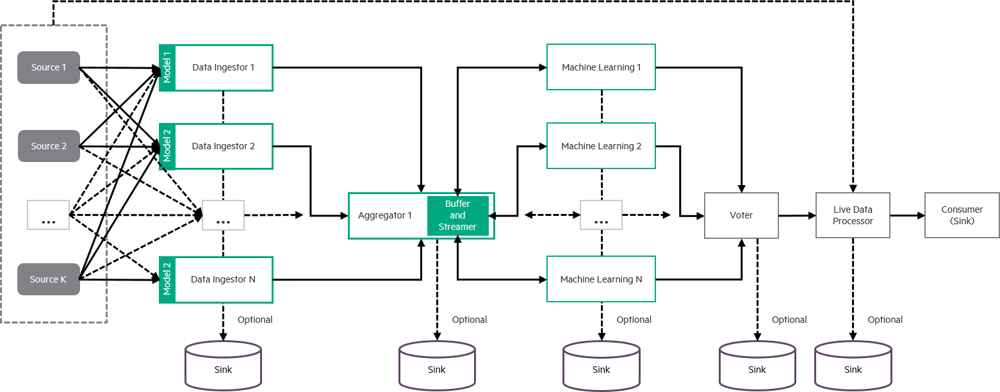

# MoNanas/Design

## Overview

MoNanas enables users to compose their data execution flow through
configuration. Each part of the configuration describes how MoNanas should
handle the data.

The needs for processing data from heterogeneous sources and a way to describe
the execution declaratively (i.e. how data flow and get processed) are
increasing. An implicit cause is the requirement to get a better insight by
utilizing the enormous amount of data we have. By taking several concepts
required to achieve that, MoNanas aims to be an statistical/analytic framework
for processing data from arbitrary sources with Monasca being the core user
to makes sense out of alerts data generated or coming into the system.

### Functional Requirements

To understand the design principle of MoNanas, first we need to understand what
the functional requirements are.

* A machine learning framework that ingests events/data from arbitrary sources
(single or multiple, homogeneous or heterogeneous), processes it and persists
into arbitrary data sinks.
* Composable components for events/data processing through configurations,
where additional machine learning algorithms can be easily integrated. For
example, a stream of events can be aggregated using a causality graph and
motif comparisons.
* An easy to use API for controlling and manipulating events/data streams as
well as querying for processed data.

> #### Additional Requirements
> * Built on open-source technologies.

## MoNanas Components

The diagram above illustrates MoNanas architecture with the following
components.

### Data Sources
A data source in MoNanas refers to the source of information including alerts,
raw events or any other data that can be pushed or pulled into the system.
This can be a streaming source or readily available data available for
accessing. MoNanas provides a few commonly used connectors including Kafka.
Since MoNanas uses Spark, any sources provided by Spark can be easily utilized
in MoNanas as well.

### Data Ingestors
Machine learning algorithms may not be implemented in such a way that it can
use data with arbitrary format as inputs. Therefore, an ingestor is required
for a specific type to convert the data into a common format, in this case,
numpy array, which can be understood by the SML functions. We provide each data
ingestor for each source available in MoNanas.

### Data Aggregators
Currently, MoNanas supports only one aggregator (`default_aggregator`). Its
responsibility is to aggregate data from different streams (from ingestors).
However, the support for multiple aggregators and multilayered aggregations
can be easily developed in the future.

### Statistical/Machine Learning (SML) Functions
An SML function may be a single machine learning algorithm or a specifically
composed sequence of algorithms that consumes numpy arrays and processes the
data to extract insights. Few SML functions are readily available for use
including LiNGAM and LibPGM for finding causality structures.

### Voters
In case where multiple SML functions are used in the orchestration of the
SML flow, voters are used to determine which outcome(s) of the SML functions
are used to process the data streamed from sources/ingestors. MoNanas's default
voter is `pick` where the user simply indicate the index of the SML function
that finishes the learning process.

### Live Data Processors
A live data processor is optional in the data execution pipeline. It takes the
outcome of a voted SML function and uses it to process the data coming from sources
or ingestors.

### Data Sinks
In MoNanas, data sinks are not necessarily persistent storage. For example, we
can push processed data back to Kafka with a different topic for Monasca or
Vitrage consumption. Any type of data can be pushed to data sink including raw
data, ingested data, processed data and outcomes of the SML functions.

## Statistical/Machine-Learning Algorithms
Statistical/Machine Learning (SML) algorithms are used to gain insights of
data ingested into MoNanas. It can be an arbitrary algorithm, a simple filter
or a composition of multiple algorithms (run in sequence, in parallel or a
combination of both) as long as it satisfies the data processing requirement.
The outputs of these algorithms are then discarded, aggregated or utilized,
usually by one or more live data processors to process the raw or ingested
data.

## Data Flow Composition
Data flow composition is a essential concept in MoNanas. It allows users to
compose a data flow and execution arbitrarily based on available components as
long as the composition is valid i.e. the connections defined by the
composition are all valid. For example, connecting a source to a voter
directly is invalid but connecting a source to a live data processor or an
ingestor is valid. Each component used in the composition can be one of many
provided by MoNanas or one of the custom developed components. Diagrams of
example compositions can be found in [MoNanas/Examples](examples.md).
