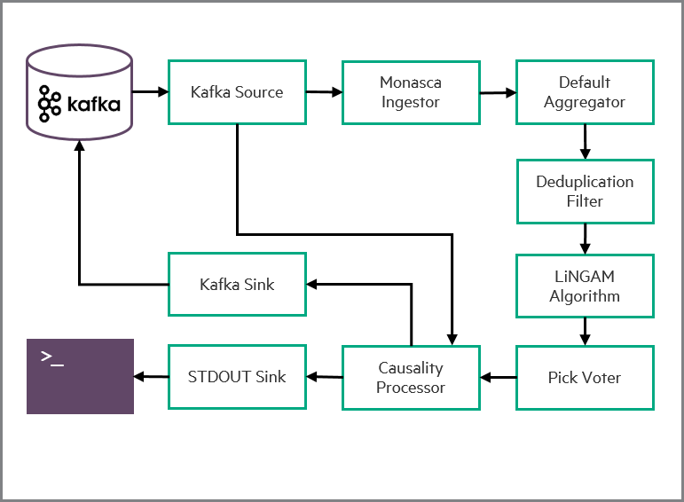
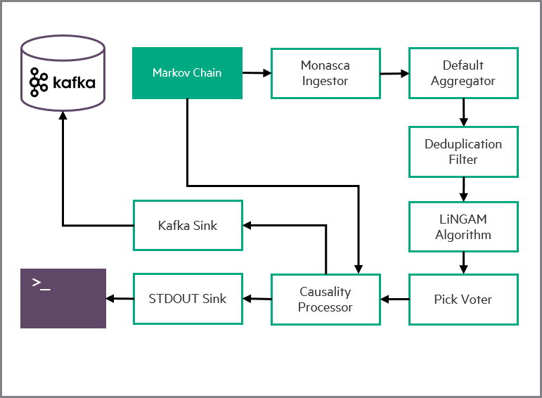
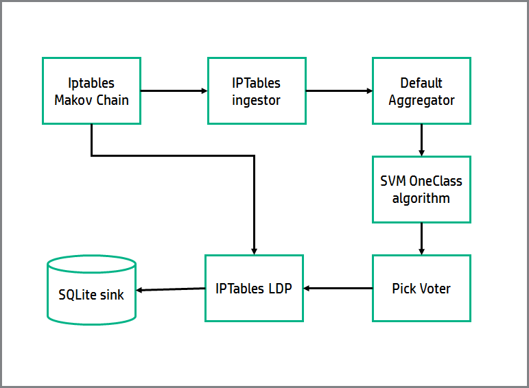
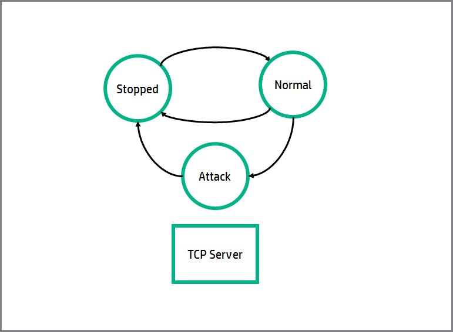

# Examples
This section shows a step-by-step guide for running examples using MoNanas.

## Alert Fatigue Management
When there are too many alerts, devops become less productive due to alert
fatigue. Using MoNanas helps devops to focus on only what matters, in many
cases, "the root causes" of those alerts. This example shows how MoNanas
ingests alerts, aggregates them based on LiNGAM, a non-gaussian methods for
estimating causal structures, and pushes aggregated alerts back to a Kafka
server.



The diagram above shows a simple data execution pipeline for consuming alerts
from Kafka server used by Monasca for messaging. However, to demonstrate this
scenario without integrating into a production environment, we use a Markov
Chain process to generate alerts (as illustrated in the diagram below) similar
to that would have been pushed to the queue by Monasca.



### Running the Example
To test this example, perform the following steps.

#### Configuration File
Before running MoNanas, we need to create a configuration file describing how
we want MoNanas to orchestrate the data execution (creating a pipeline). You can find the following configuration in `$HOME/config/markov_source_config.json`:


```json
{
    "spark_config": {
        "appName": "testApp",
        "streaming": {
            "batch_interval": 1
        }
    },
    "server": {
        "port": 3000,
        "debug": false
    },
    "sources": {
        "src1": {
            "module": "CloudMarkovChainSource",
            "params": {
                "server_sleep_in_seconds": 0.01
            },
            "transitions": {
                "web_service": {
                    "run=>slow": {
                        "0": 0.001,
                        "8": 0.02,
                        "12": 0.07,
                        "14": 0.07,
                        "22": 0.03,
                        "24": 0.001
                    },
                    "slow=>run": {
                        "0": 0.99,
                        "8": 0.7,
                        "12": 0.1,
                        "14": 0.1,
                        "22": 0.8,
                        "24": 0.99
                    },
                    "stop=>run": 0.7
                },
                "host": {
                    "on=>off": 0.005,
                    "off=>on": 0.5
                },
                "switch": {
                    "on=>off": 0.01,
                    "off=>on": 0.7
                }
            },
            "triggers": {
                "support": {
                    "get_called": {
                        "0": 0.1,
                        "8": 0.2,
                        "12": 0.8,
                        "14": 0.8,
                        "22": 0.5,
                        "24": 0.0
                    }
                }
            },
            "graph": {
                "h1:host": ["s1"],
                "h2:host": ["s1"],
                "s1:switch": [],
                "w1:web_service": ["h1"],
                "w2:web_service": ["h2"]
            }

        }
    },
    "ingestors": {
        "ing1": {
            "module": "CloudIngestor"
        }
    },
    "smls": {
        "sml1": {
            "module": "LiNGAM",
            "params": {
                "threshold": 0.5
            }
        }
    },
    "voters": {
        "vot1": {
            "module": "PickIndexVoter",
            "params": {
                "index": 0
            }
        }
    },
    "sinks": {
        "snk1": {
            "module": "KafkaSink",
            "params": {
                "host": "localhost",
                "port": 9092,
                "topic": "transformed_alerts"
            }
        }
    },
    "ldps": {
        "ldp1": {
            "module": "CloudCausalityLDP"
        }
    },
    "connections": {
        "src1": ["ing1", "ldp1"],
        "sml1": ["vot1"],
        "ing1": [],
        "vot1": ["ldp1"],
        "ldp1": ["snk1"],
        "snk1": []
    },
    "feedback": {}
}
```

The flow of data execution is defined in `connections`. In this case, data
are ingested from `src1` where Monasca-like alerts are being generated
using Markov Chain process. The data are then ingested by `ing1` where
each entry is converted into a format suitable for machine learning algorithm.
MoNanas uses `numpy.array` as a standard format. Typically, an aggregator is
responsible for aggregating data from different ingestors but in this scenario,
there is only one ingestor, hence the implicit aggregator (not defined in the
configuration) simply forwards the data to `sml1`, which simply deduplicates
the data then uses LiNGAM algorithm to find a causality structure of the
aggregated data then passes the result (structure) to `vot1`. The voter is
configured to pick the output of the first SML function and forwards that to
`ldp1`. Here, the live data processor transforms data streamed from `src1`
using the causality structure and pushes it to standard output as well as the
specified Kafka server.

#### Run MoNanas
As the sink of this orchestration is Kafka, we need to run Apache Zookeeper
and Apache Kafka first.

```bash
$KAFKA_HOME/bin/zookeeper-server-start.sh \
  $KAFKA_HOME/config/zookeeper.properties

$KAFKA_HOME/bin/kafka-server-start.sh \
  $KAFKA_HOME/config/server.properties
```

After that, start MoNanas as follows.

```bash
python $MONANAS_HOME/run.py -p $SPARK_HOME -c $HOME/tmp/alert_example.json \
  -l $MONANAS_HOME/config/logging.json
```

A default logging configuration file is located in `$MONANAS_HOME/config`.
Users can override this option. Currently, `-l` option is mandatory as MoNanas
does not assume a default configuration.

#### Start Data Execution
MoNanas exposes REST API for controlling the data execution. Use any HTTP
client to POST with the following request body to MoNanas server to start
data streaming.

```json
{
  "action": "start_streaming"
}
```
e.g. using curl from terminal to make a request assuming the server is running
locally.
```bash
curl -H "Content-Type: application/json" -X POST \
  -d '{"action": "start_streaming"}' \
  http://localhost:3000/api/v1/actions
```

#### Results
The sinks for the transformed (processed) alerts defined in the configuration
are via standard output and Kafka server. Therefore, the output will be
displayed in the console. Alternatively, users can subscribe to a queue
with the topic `transformed_alerts` using any Kafka client. A result example
(live data processing with aggregation mode based on causality structure) found
by LiNGAM algorithm is shown below.

```json
{
  "alarm_id": "219e65b8-395a-4588-a792-799fdbeef455",
  "id": "1452900361688",
  "metrics": [
    "..."
  ],
  "new_state": "OK",
  "old_state": "UNDETERMINED",
  "reason": "The alarm threshold(s) have not been exceeded.",
  "reason_data": "{}",
  "sub_alarms": [
    "..."
  ],
  "timestamp": "2016-01-15T23:26:01.688Z",
  "__monanas__": {
    "causes": [
      "9b0129fa-7869-4436-8319-68bfa8bc88a1",
      "3f4b2651-41f5-4f2a-8093-e9ad8cd5b7bf"
    ]
  }
}
```

The alert shown above has been annotated with MoNanas's specific metadata,
`__monanas__`. In this case where the mode of live data processing is
`aggregation`, IDs of the alerts caused by this one are added onto a list,
`causes`.

> Note: The underlying causality structure is a directed acyclic graph.

In contrast, if the `filter` mode is used, the result format would be identical to
the source input format. So you can typically use it anywhere in existing data
flow. In this mode, only root cause alerts are preserved. A result example
under this mode is shown below.

## Anomalies in Rule Firing Patterns

Some attacks can be recognized by patterns of rules being triggered in an anomalous fashion. For example, a Ping flood, a denial of service attack that consist in sending multiple pings to a system, would trigger IPTable rules handling the Ping much more often than if the system is not being attacked.

This example shows how MoNanas ingests iptables firing data, trains an anomaly detection algorithm (SVM One Class), and then uses the trained algorithm to detect when the system is being attacked, which is detected as an anomaly. Finally the data is stored in a SQLite database via the SQLite sink.



The diagram above shows a simple data execution pipeline for generating and consuming IPTables triggering data. The source is a TCP server that generates mock data, triggering IPTables according to the logic provided by this Markov Chain:



As you can see, there are 3 states: `stopped`, `normal`, and `attack`. Each transition marked in the diagram  can happen with some probability each time period: we made sure that the system stays in `normal` state most of the time.
The system triggers 12 possible IPTables, classified in four families: `ssh`, `concrete IPs`, `http`, and `ping` with different probabilities according to the state of the system, in order to model possible ping flood attacks:

1) State `stopped`: nothing is triggered
2) State `normal`: higher probability for http traffic, but some of the other rules will be triggered.
3) State `attack`: very high probability of triggering `ping` traffic in every timestamp, keeping the rest of probabilities as they were in `normal` state.

The ingestor consumes data from the markov chain IPTable source, and counts the number of times that an IPTable of each family has been triggered in every time window, generating a 4D array per time window (one dimension per IPTable type).

The SML block is an anomaly detection algorithm which is based in SVM (Support Vector Machines). In the first phase of MoNanas execution, it trains the classifier, learning the border in the space of arrays generated by the ingestor between anomalies and non-anomalies.

After the pick voter selects the only available SML, the LDP module is ready to find anomalies in real time in phase 2. It uses the feature names returned by the IPTables Markov chain source class, which are the IPTable type represented in each position of the arrays. When new data of triggered IPTables arrive to the IPTables LDP, it is classified as anomaly or non-anomaly, and the dstream is modified with this information.

Finally the SQLite sink saves the classified data to a SQLite database.

### Running the Example
To test this example, perform the following steps.

#### Configuration File
Before running MoNanas, we need to create a configuration file describing how
we want MoNanas to orchestrate the data execution (creating a pipeline). You can find the following configuration in `$HOME/config/iptables_anomalies.json`:

```json
{
    "spark_config": {
        "appName": "testApp",
        "streaming": {
            "batch_interval": 1
        }
    },
    "server": {
        "port": 3000,
        "debug": false
    },
    "sources": {
        "src1": {
            "module": "IPTablesSource",
            "params": {
                "server_sleep_in_seconds": 0.01
            }
        }
    },
    "ingestors": {
        "ing1": {
            "module": "IptablesIngestor"
        }
    },
    "smls": {
        "sml1": {
            "module": "SvmOneClass"
        }
    },
    "voters": {
        "vot1": {
            "module": "PickIndexVoter",
            "params": {
                "index": 0
            }
        }
    },
    "sinks": {
        "snk1": {
            "module": "IptablesSQLiteSink"
        },
        "snk2": {
            "module": "StdoutSink"
        }
    },
    "ldps": {
        "ldp1": {
            "module": "IptablesLDP"
        }
    },
    "connections": {
        "src1": ["ing1", "ldp1"],
        "ing1": [],
        "sml1": ["vot1"],
        "vot1": ["ldp1"],
        "ldp1": ["snk1", "snk2"],
        "snk1": [],
        "snk2": []
    },
    "feedback": {}
}
```

The flow of data execution is defined in `connections`, with the origin being the keys of the dictionary, and the destinations are each element of the list associated to each origin.
As you can see, the flow described in the previous section is mapped to the configuration, except for the ingestor, which is not explicitly connected; the reason for this is that all ingestors are connected to the aggregator, which is connected to all SMLs, so no explicit connection needs to be defined. 

#### Run MoNanas
Start MoNanas as follows:

```bash
python $MONANAS_HOME/run.py -p $SPARK_HOME -c $HOME/config/iptables_anomalies.json \
  -l $MONANAS_HOME/config/logging.json
```
If you want to run your own configuration you will need to change the value of the -c parameter.

#### Start Data Execution
MoNanas exposes a REST API for controlling the data execution. Use any HTTP
client to POST with the following request body to MoNanas server (running on your localhost, at port 3000 by default) to start data streaming.

```json
{
  "action": "start_streaming"
}
```
e.g. using curl from terminal to make a request assuming the server is running
locally.
```bash
curl -H "Content-Type: application/json" -X POST \
  -d '{"action": "start_streaming"}' \
  http://localhost:3000/api/v1/actions
```

#### Stop Data Execution
When you want to stop the example, you can send another HTTP POST to order MoNanas to stop streaming data. In this case, the request body should be:

```json
{
  "action": "stop_streaming"
}
```
e.g. using curl from terminal to make a request assuming the server is running
locally.
```bash
curl -H "Content-Type: application/json" -X POST \
  -d '{"action": "stop_streaming"}' \
  http://localhost:3000/api/v1/actions
```

#### Results
By default, the pre-selected logging level defined in `$MONANAS_HOME/config/logging.json` lets you see relevant information in the screen during this execution of this example.
The classified data generated by the LDP module is saved in a SQLite database located by default in `sqlite_sink.db` file; please feel free to inspect the database to see what was classified as anomaly and what was classified as normal traffic.
