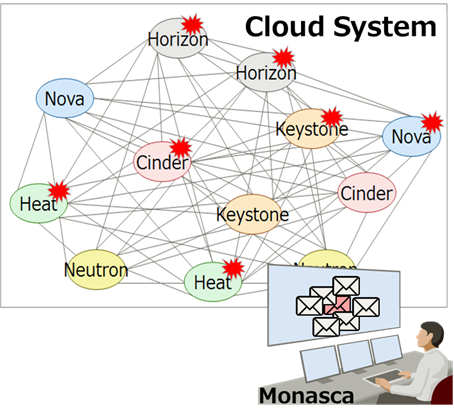
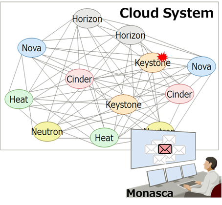

# Integrate with Monasca
This section shows a step-by-step guide for integration MoNanas with Monasca.

## Alarm management

For example, let's say you have a some cloud system built on OpenStack,
and all services have been monitored by Monasca.

Operators got tons of alarms when a trouble happened
even if there is actual trouble in one service.



Integrating MoNanas and Monasca eliminates unnecessary alarms.
And save the operator from long investigation works!




### Running the MoNanas
To manage alarms from Monasca, perform the following steps.


#### Alarm Definition in Monasca.

Refer to [Monanas API](https://github.com/openstack/monasca-api/blob/master/docs/monasca-api-spec.md).

#### Configuration File in MoNanas

Before running MoNanas, we need to create a configuration file describing how
we want MoNanas to orchestrate the data execution (creating a pipeline).

You can edit configuration in `$MONANAS_HOME/config/markov_source_config.json` like the following.

```json
{
    "spark_config": {
        "appName": "testApp",
        "streaming": {
            "batch_interval": 1
        }
    },
    "server": {
        "port": 3000,
        "debug": false
    },
    "sources": {
        "src1": {
            "module": "TextFileSource",
            "params": {
                "dir": "/tmp/source_data"
            },
            "features": [
                         "api_response.time.5sec.cinder1",
                         "api_response.time.5sec.cinder2",
                         "api_response.time.5sec.heat1",
                         "api_response.time.5sec.heat2",
                         "api_response.time.5sec.keystone1",
                         "api_response.time.5sec.keystone2",
                         "api_response.time.5sec.neutron1",
                         "api_response.time.5sec.neutron2",
                         "api_response.time.5sec.nova1",
                         "api_response.time.5sec.nova2"
                        ]
        }
    },
    "ingestors": {
        "ing1": {
            "module": "CloudIngestor"
        }
    },
    "smls": {
        "sml1": {
            "module": "LiNGAM",
            "threshold": 0.5
        }
    },
    "voters": {
        "vot1": {
            "module": "PickIndexVoter",
            "index": 0
        }
    },
    "sinks": {
        "snk1": {
            "module": "FileSink2",
            "params": {
                "dir": "/var/tmp/result/markov",
                "file_prefix": "result"
            }
        },
        "snk2": {
            "module": "StdoutSink"
        }
    },
    "ldps": {
        "ldp1": {
            "module": "CloudCausalityLDP"
        }
    },
    "connections": {
        "src1": ["ing1", "ldp1"],
        "sml1": ["vot1"],
        "ing1": [],
        "vot1": ["ldp1"],
        "ldp1": ["snk1"],
        "snk1": [],
        "snk2": []
    },
    "feedback": {}
}
```

The flow of data execution is defined in `connections`. In this case, data
are ingested from `src1`. The data are then ingested by `ing1` where
each entry is converted into a format suitable for machine learning algorithm.
MoNanas uses `numpy.array` as a standard format. Typically, an aggregator is
responsible for aggregating data from different ingestors but in this scenario,
there is only one ingestor, hence the implicit aggregator (not defined in the
configuration) simply forwards the data to `sml1`, which simply deduplicates
the data then uses LiNGAM algorithm to find a causality structure of the
aggregated data then passes the result (structure) to `vot1`. The voter is
configured to pick the output of the first SML function and forwards that to
`ldp1`. Here, the live data processor transforms data streamed from `src1`
using the causality structure and pushes it to standard output as well as the
specified Kafka server.

#### Run MoNanas

As the sink of this orchestration is Kafka, we need to run Apache Zookeeper
and Apache Kafka first.

```bash
$KAFKA_HOME/bin/zookeeper-server-start.sh \
  $KAFKA_HOME/config/zookeeper.properties

$KAFKA_HOME/bin/kafka-server-start.sh \
  $KAFKA_HOME/config/server.properties
```

After that, start MoNanas as follows.

```bash
python $MONANAS_HOME/run.py -p $SPARK_HOME -c $MONANAS_HOME/config/markov_source_config.json \
  -l $MONANAS_HOME/config/logging.json
```

A default logging configuration file is located in `$MONANAS_HOME/config`.
Users can override this option. Currently, `-l` option is mandatory as MoNanas
does not assume a default configuration.

#### Start Data Execution

MoNanas exposes REST API for controlling the data execution. Use any HTTP
client to POST with the following request body to MoNanas server to start
data streaming.

```json
{
  "action": "start_streaming"
}
```
e.g. using curl from terminal to make a request assuming the server is running
locally.
```bash
curl -H "Content-Type: application/json" -X POST \
  -d '{"action": "start_streaming"}' \
  http://localhost:3000/api/v1/actions
```

#### Results

The sinks for the transformed (processed) alerts defined in the configuration
are via standard output and Kafka server. Therefore, the output will be
displayed in the console. Alternatively, users can subscribe to a queue
with the topic `transformed_alerts` using any Kafka client. A result example
(live data processing with aggregation mode based on causality structure) found
by LiNGAM algorithm is shown below.

```json
{
    "alarm": {
        "state": "ALARM",
        "alarm_definition": {
            "name": "api_response.time.5sec.nova2"
        }
    },
    "__monanas__":
        [
            {
                "causes": [
                    "api_response.time.5sec.neutron2",
                    "api_response.time.5sec.cinder1",
                    "api_response.time.5sec.nova1",
                    "api_response.time.5sec.keystone1",
                    "api_response.time.5sec.keystone2"
                ]
            },
            {
                "results": [
                    "api_response.time.5sec.cinder2",
                    "api_response.time.5sec.heat1",
                    "api_response.time.5sec.heat2",
                    "api_response.time.5sec.nova1",
                    "api_response.time.5sec.neutron1",
                    "api_response.time.5sec.keystone1"
                 ]
            }
        ]
}
```


